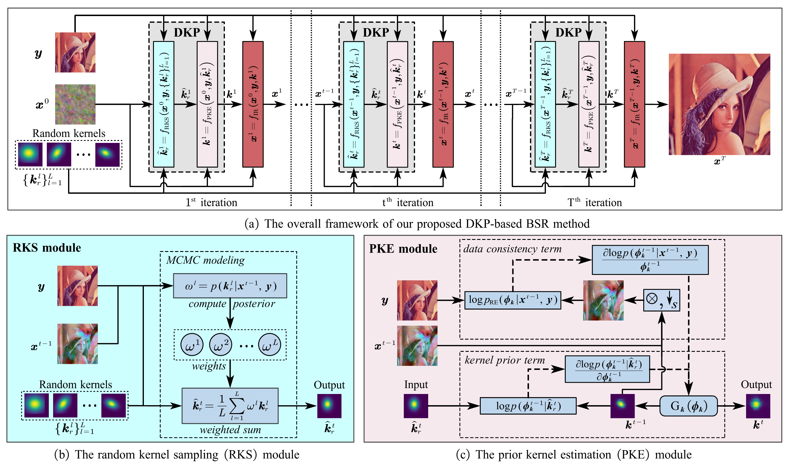

# A Dynamic Kernel Prior Model for Unsupervised Blind Image Super-Resolution (DKP), CVPR2024

This repository is the official PyTorch implementation of DKP to Blind Super-Resolution 
([arXiv](https://arxiv.org/abs/2404.15620), [supp](https://github.com/XYLGroup/DKP)).

 ---

> Deep learning-based methods have achieved significant successes on solving the blind super-resolution (BSR) problem. However, most of them request supervised pre-training on labelled datasets.
This paper proposes an unsupervised kernel estimation model, named dynamic kernel prior (DKP), to realize an unsupervised and pre-training-free learning-based algorithm for solving the BSR problem. 
DKP can adaptively learn dynamic kernel priors to realize real-time kernel estimation, and thereby enables superior HR image restoration performances. 
This is achieved by a Markov chain Monte Carlo sampling process on random kernel distributions. 
The learned kernel prior is then assigned to optimize a blur kernel estimation network, which entails a network-based Langevin dynamic optimization strategy. 
These two techniques ensure the accuracy of the kernel estimation.
DKP can be easily used to replace the kernel estimation models in the existing methods, such as Double-DIP and FKP-DIP, or be added to the off-the-shelf image restoration model, such as diffusion model. 
In this paper, we incorporate our DKP model with DIP and diffusion model, referring to DIP-DKP and Diff-DKP, for validations. 
Extensive simulations on Gaussian and motion kernel scenarios demonstrate that the proposed DKP model can significantly improve the kernel estimation with comparable runtime and memory usage, leading to state-of-the-art BSR results. 
><p align="center">
  > 
</p>

## Requirements
- pip install numpy torch blobfile tqdm pyYaml pillow    # e.g. torch 1.7.1+cu110.

### Pre-Trained Models for DiffDKP
To restore general images, download this [model](https://openaipublic.blob.core.windows.net/diffusion/jul-2021/256x256_diffusion.pt)(from [guided-diffusion](https://github.com/openai/guided-diffusion)) and put it into `DiffDKP/data/pretrained/`.
```
wget https://openaipublic.blob.core.windows.net/diffusion/jul-2021/256x256_diffusion.pt
wget https://openaipublic.blob.core.windows.net/diffusion/jul-2021/256x256_classifier.pt
```
Note that the pre-trained models are only used for DiffDKP, DIPDKP is processed without pre-trained models.

## Quick Run DIPDKP
To run the code without preparing data, run this command:
```bash
cd DIPDKP/DIPDKP
python main.py
```

## Quick Run DiffDKP
To run the code without preparing data, run this command:
```bash
cd DiffDKP
python main.py
```

---

## Data Preparation for DIPDKP
To prepare testing data, please organize images as `data/datasets/Set5/HR/baby.png`, and run this command:
```bash
cd DIPDKP/data
python prepare_dataset.py --model DIPDKP --sf 2 --dataset Set5
```

## Data Preparation for DiffDKP
To prepare testing data, please organize images as `data/datasets/deblur/Set5/HR_256/baby.png`, and run this command:
```bash
cd DiffDKP/data
python prepare_dataset.py --model DIPDKP --sf 2 --dataset Set5
```


Commonly used datasets can be downloaded [here](https://github.com/xinntao/BasicSR/blob/master/docs/DatasetPreparation.md#common-image-sr-datasets).


## Acknowledgement

This project is released under the Apache 2.0 license. The codes are based on [FKP](https://github.com/JingyunLiang/FKP) and [DDNM](https://github.com/wyhuai/DDNM). Please also follow their licenses. Thanks for their great works.


